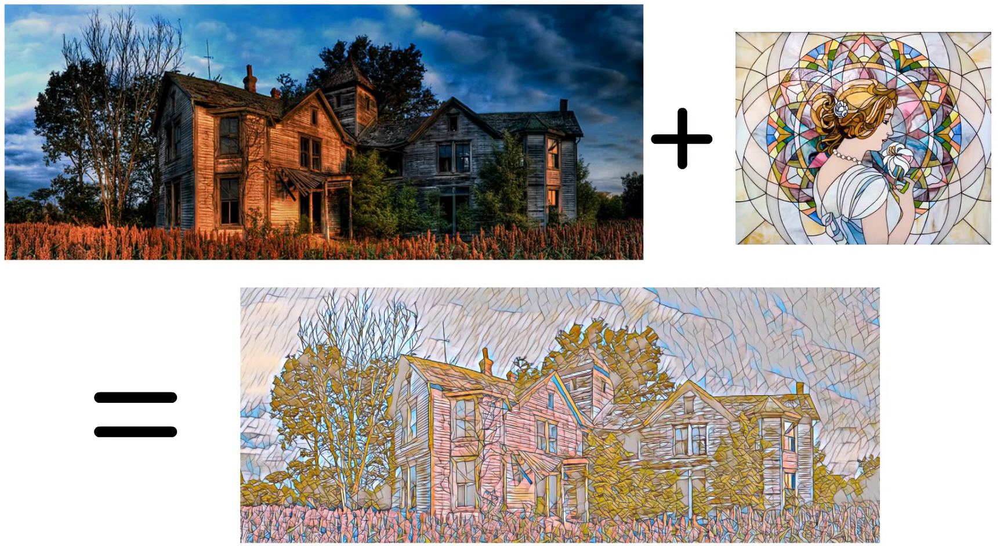
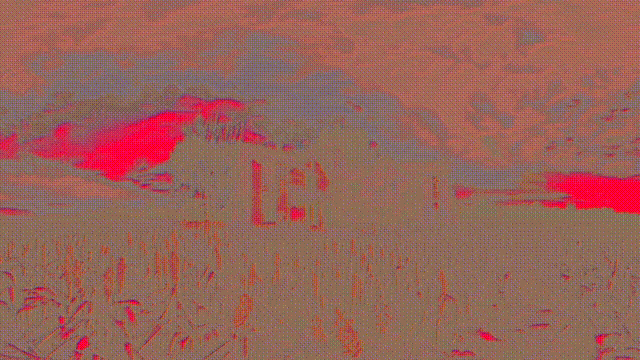

# Fast Neural Style Transfer in PyTorch



**Czech education video here:**  https://youtu.be/99vXQcHzRBo

Pretrained models [here](https://drive.google.com/drive/folders/1aRD6zakhcDImN2Y54qAT6f4801iLcCLB?usp=sharing).

## Dataset
Download random images and paste them into ./demo_dataset/1

Part of demo dataset downloaded from: https://www.kaggle.com/shamsaddin97/image-captioning-dataset-random-images


## Train

```
python3 train.py  --dataset_path <path-to-dataset> \
                  --style_image <path-to-style-image> \
                  --epochs 1 \
                  --batch_size 4 \
                  --image_size 256
```

####Demo train
```
python3 train.py  --dataset_path images/demo_dataset \
                  --style_image images/styles/cuphead.jpg \
                  --epochs 100 \
                  --batch_size 2 \
                  --image_size 256
```
or simply (using default parameters):
```
python3 train.py
```

####Train process


## Test on Video

```
python3 test_on_video.py  --video_path <path-to-video> \
                          --checkpoint_model <path-to-checkpoint> \
```


## Test on Image

```
python3 test_on_image.py  --image_path <path-to-image> \
                          --checkpoint_model <path-to-checkpoint> \
```
